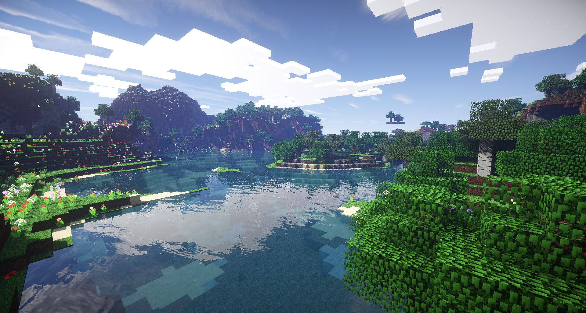

In _No Man's Sky_, PCG is used to generate a near infinite universe of unique planets with unique flora and fauna:

_Dwarf Fortress_ uses procedural generation to both generate an entire fantasy world and populate it with a full-blown history with detailed events and characters:

In _Minecraft_, all terrain is procedurally generated, and premade structures are placed procedurally in that terrain:

Both _Star Citizen_ and _Elite: Dangerous_ use PCG to generate seamless planets, and _Elite_ uses real-world astronomical data to generate an entire galaxy full of those planets:

