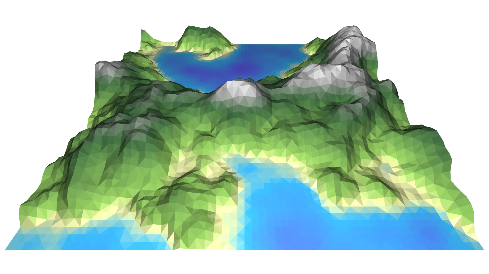
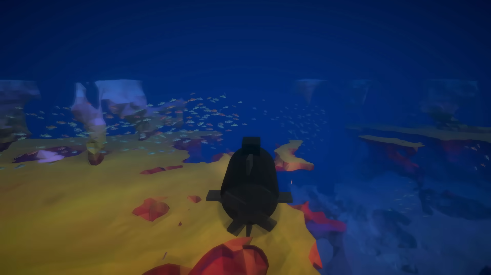

From Wikipedia[^wiki]:

> In [computing](https://en.wikipedia.org/wiki/Computing "Computing"), **procedural generation** (sometimes shortened as **proc-gen**) is a method of creating data [algorithmically](https://en.wikipedia.org/wiki/Algorithm "Algorithm") as opposed to manually, typically through a combination of human-generated content and algorithms [...] In video games, it is used to automatically create large amounts of content in a game. Depending on the implementation, advantages of procedural generation can include [...] larger amounts of content, and randomness for less predictable gameplay.

Procedural content generation, or *PCG*, basically means defining a set of rules that a PCG framework uses to, for example, automatically place assets in an environment.

A great example use case would be the generation of forests; instead of having environment artists place each tree by hand PCG can automatically generate endless, realistic tree placements, given a correct ruleset:

Procedural generation can be used for a much wider variety of content, but in video games it is almost exclusively used for the generation of terrain or other surfaces, and placement of premade assets on those surfaces. PCG is also often used for the generation of layouts like dungeons.

## The current State of the Art
There are multiple 'flavours' of procedural generation techniques that are currently being developed and improved[^survey]:

### Pseudo-Random Number Generators
_Pseudo-Random Number Generators (PRNG)_ is one of the oldest and most well-established generation technique. Noise, _L-Systems_ and fractals are used (and often combined) to mimic the randomness found in nature. 

This technique is also easy to parametrically control using e.g. splines to avoid completely random content, or for artistic control. By itself, there isn't much untapped potential left for this technique, both because of its age and simplicity.

Commonly, PRNG is used to cheaply generate terrain and textures. 

### Generative Grammars
Originally developed in the 1960s for the generation of grammatically correct sentences, _Generative Grammars (GG)_ are sets of rules that operate on individual words. The encoding of elements of an object as letters/words can then yield correct objects/shapes.

There are different types of grammars used for content generation:
- _Lindenmayer-Systems (L-systems)_; grammars consisting of symbols describing the characteristics of an object. A generated sentence/string describes the structure or behaviour of an object.
- _Split Grammars_; grammars similar to L-systems that work on encoded shapes. New shapes are generated by applying shape-to-shape rewriting rules that turn one shape (or more) into another.
- _Wall Grammars_; similar to split grammars, wall grammars are specifically designed to create building exteriors. More advanced rules are used to generate e.g. balconies and fire escapes.
- _Shape Grammars_; due to being context-sensitive and sequential, shape grammars have a more involved rewriting process than L-systems or split grammars, resulting in more complex structures.

In games, this technique is commonly used for generating building exteriors and dungeon layouts. Though this technique is still being applied in novel ways, for example, mixed with machine learning[^gg-ml], the technique itself is at its core not changing much anymore, much like PRNG. 

### Spatial Algorithms
_Spatial Algorithms (SA)_ manipulate a given space to generate game content. The output is generated from a structure like a grid, or using self-recurrence. Examples of spatial algorithms use tiling, layering, grid subdivision, fractals and Voronoi diagrams.

A common use of SA is in tree generation:

The complexity of content generated using SA is of course only limited by the formulas and patterns that can be thought of, but in the context of content generation for games, the core of the technique has not seen much development recently.

### Modelling and Simulation of Complex Systems
Sometimes it is impractical to mimic natural phenomena using maths. Models and simulations can produce more accurate results and can be much simper to implement. Under the umbrella of these _Complex Systems (CS)_ fall cellular automata, tensor fields and agent-based simulation; think of _Conway's Game of Life_, mountain generation and boids respectively.

An example of this is Sebastian Lague's combination of boids with _marching cubes_, an algorithm for generating 3-dimensional geometry from noise[^lague]:

### Artificial Intelligence
Unsurprisingly, the content generation technique that currently sees the most development uses artificial intelligence (AI) to generate yet more complex and realistic content.

One of the approaches to AI  in PCG is _Genetic Algorithms_; These algorithms mimic biological evolution. A pool of _instances_ compete in outputting the best result, judged by a fitness function. The instance that performs the best is used to create the next (randomly mutated) pool of instances, and the process repeats. A downside to this approach is that a fitness function for complex game content is, at the least, highly impractical make. It works well for NPCs, though.

Another common approach is the modelling of _Neural Networks_; This approach uses an artificial neural network that tries to match inputs with outputs. It has the ability to learn from patterns to later match similar patterns. Again, a fitness function is used to determine the success of a match. Though it is well suited for, for example, recognizing handwriting or drawings, it is impractical for complex game content.

## Actionable Steps
Though much can already be done using developed techniques, there are many _actionable steps_ left to take. 

J. Togelius (et al.) has kindly provided a list of example projects for "anyone wishing to contribute to advancing the state of the art of procedural content generation":[^steps]

- The generation of complete, very simple games: Targeting games that would run on an older console like the _Atari 2600_, this would be a first step towards generating complete AAA games procedurally. The restrictions of the target console serves to restrict the pool of games to take train on, as well as simplifying the generation process.
- Procedural animation of procedurally generated creatures: This would involve animation in the PCG process. The creature creation in _Spore_ is similar, but is user-controlled and places restrictions on the creature creation for compatibility with existing animations.
- Quest-populated map generation; Rather than generating a map separately, and populating it with quests, this technique would combine the two in order to make the maps interesting and narrative-driven, rather than having to conform the quests to an existing map.
- Generation of interesting 2D platformer levels; Though the procedural generation of 2D platformer levels for e.g. _Super Mario Bros_ is an established technology, these levels generally lack a sense of progression, narrative or high-level structure, making them boring or uninteresting. A level generator that does include these elements is yet to be devised.

[^wiki]: Wikimedia Foundation. (2024, May 11). _Procedural generation_. Wikipedia. https://en.wikipedia.org/wiki/Procedural_generation
[^survey]: Mark Hendrikx, Sebastiaan Meijer, Joeri Van Der Velden, and Alexandru Iosup. 2013. Procedural content generation for games: A survey. ACM Trans. Multimedia Comput. Commun. Appl. 9, 1, Article 1 (February 2013), 22 pages. https://doi.org/10.1145/2422956.2422957
[^gg-ml]: J. Gutierrez and J. Schrum, "Generative Adversarial Network Rooms in Generative Graph Grammar Dungeons for The Legend of Zelda," _2020 IEEE Congress on Evolutionary Computation (CEC)_, Glasgow, UK, 2020, pp. 1-8, doi: 10.1109/CEC48606.2020.9185631.
[^lague]: https://www.youtube.com/watch?v=bqtqltqcQhw
[^steps]: Togelius, J. & Champandard, A.J. & Lanzi, Pier Luca & Mateas, M. & Paiva, A. & Preuss, Mike & Stanley, K.O.. (2013). Procedural content generation: goals, challenges and actionable steps. Dagstuhl Follow-Ups. 6. 61-75. 