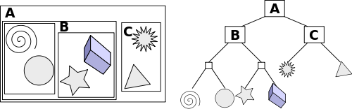
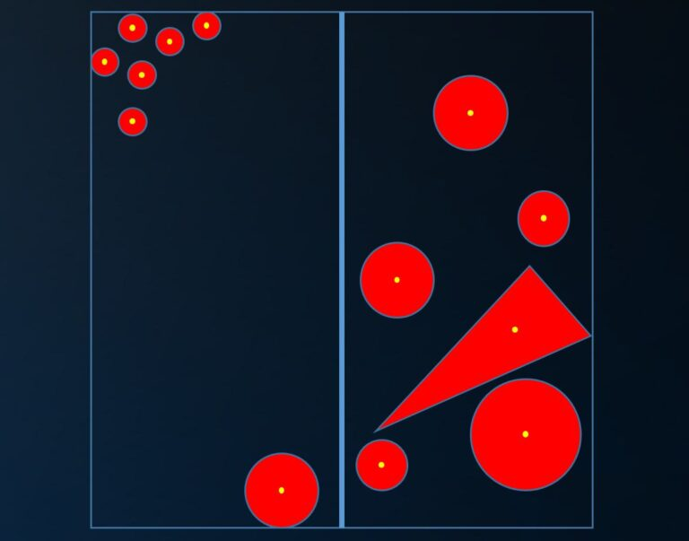

 A naïve approach to raytracing multiple objects would be simply intersecting with all of them and taking the closest hit. Obviously, this is not very efficient when dealing with a larger number of objects.

A solution would be grouping objects in small clusters with an AABB bounding box. Now we only have to intersect with the objects in a cluster if the ray intersects with its bounding box, which is a cheap check. Nesting this results in a _bounding volume hierarchy_. We narrow down which objects we have to check node by node until we get to a cluster of objects, a _leaf_:


## Implementation
We start the implementation with a node data structure:
```cpp
struct Node
{
	AABB bounds;
	bool isLeaf;

	union
	{
		Node* children;  // when !isLeaf
		Object* objects; // when isLeaf
	}
}
```
These nodes can be either a normal node with child nodes, or a leaf that contains a number of objects.

## Constructing the BVH
We start the construction by creating a root node whose bounding box encompasses all objects. We then apply the following steps recursively:
1. Split children
2. Calculate bounds of children
3. Repeat for children

We continue until an end criteria is met. Generally this is when there is only a certain number of children left in the current node. Note that this is basically quicksort.

A more practical tutorial on constructing a BVH can be found [here](https://jacco.ompf2.com/2022/04/13/how-to-build-a-bvh-part-1-basics/).
### Splitting
There's a number of approaches to splitting the children of a node. A simple naïve approach would be splitting the children along the longest axis of the bounding box:


For more efficient splitting strategy's go do research.

## Intersecting
When sending a ray, we recursively check if we intersect with the bounding box of a node, and if we do, repeat for its children. Once we end up with a leaf, we intersect with the objects associated with it.

Note that one ray may intersect with multiple sub-nodes. The closest hit should be taken.