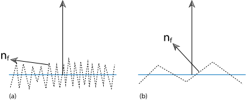

A ray tracer "shoots" out a ray from the camera through each pixel in the screen and out into the world, hitting surfaces that will give it its color:

NOTE: These concepts are also explained in the Block B [lecture on raytracing](https://edubuas.sharepoint.com/:b:/t/2023-24CFGA1.P3PRRaytracing/EZjfd2z5UjBFhKzetAtv60cBac56E6Kt__kHl6DF_9EWHg?e=2TTjXI) (starting at slide 24).
## Tracing Rays
A ray has an origin and a direction and when given a parameter results in a point along that ray:
$$P(t) = A + B \cdot t$$
where $A$ is the origin, $B$ is the direction and $t$ is the parameter.

The direction of these rays is generally the UV coordinate of its pixel multiplied by the in-world dimensions of the window/image.

**NOTE:** When a ray hits at $P(t)$ where $t \leq 0$ the hit is invalid.
### Spheres
Recall the equation for a sphere:
$$(x - a)^2 + (y - b)^2 + (z - c)^2 = r^2$$
In terms of vectors $P = (x, y, z)$ and $C = (a, b, c)$ this becomes:
$$dot(P - C, P - C) = r^2$$
Any point $P$ that satisfies this equation thus lies on the surface of the sphere:
$$dot(P(t) - C, P(t) - C) = r^2$$
$$dot(A + B \cdot t - C, A + B \cdot t - C) = r^2$$
$$t \cdot t \cdot dot(B, B) + 2 \cdot t \cdot dot(A-C, A-C) + dot(C, C) - r^2 = 0$$
Since this is in the form of $ax^2 + bx + c = 0$ we have at least one hit if the discriminant ($b^2 - 4 \cdot a \cdot c$) is zero or positive.

Putting this in code **and accounting for the offset from the origin** we get:
```cpp
bool hit_sphere(vec3 C, float r, Ray ray) {
	vec3 Crel = ray.origin - C;
	float a = dot(ray.direction, ray.direction);
	float b = 2 * dot(Crel, ray.direction);
	float c = dot(Crel, Crel) - r*r;
	return b*b - 4*a*c >= 0;
}
```

To get the normal we solve for and return the smallest $t$:
```cpp
	...
	float d = b*b - 4*a*c > 0;
	if (d >= 0) return (-b - sqrt(d)) / (2 * a);
	// you should account for `-b + ...`
}
```
We can then just get the normal by subtracting the sphere's center from the point at that $t$, and taking the unit vector from that.

For an in-depth tutorial see [The Cherno's video](https://www.youtube.com/watch?v=4NshnkzOdI0&t=1s).
## Lighting
The light that hits a surface from any light/emitter depends on a few factors:
1. Light Occlusion, or if the light is blocked or not.
1. Attenuation, or intense the light is at a distance;
1. Angle of Incidence, or how spread out the light is;
1. Absorption, or how much light is absorbed by the surface; 

These steps are also explained in the block B [lights lecture](https://edubuas.sharepoint.com/:b:/t/2023-24CFGA1.P3PRRaytracing/EZjfd2z5UjBFhKzetAtv60cBac56E6Kt__kHl6DF_9EWHg?e=2TTjXI)
### Light Occlusion
If a light is blocked, it will not contribute to reflection at all, obviously. This is checked using a shadow ray, which originates at the intersection point $I$:
$$p(t) = I + t \vec{D}$$
The direction $D$ is pointed to the light, and normalized:
$$\vec{D} = normalize(P_{light} = I) = \frac{P_{light} - I
}{||P_{light} - I||}$$
**NOTE:** It is wasteful to trace the ray all the way to the light as something might be blocking it halfway through. We only need to know if the light is occluded or not, so the trace can stop as soon as it hits anything.
#### Shadow Acne
Starting the shadow trace at $t = 0$ can cause shadow acne, as the trace might hit the surface at the intersection point. This can be fixed tracing not from $t = 0$, but some small value above 0. It is recommended to cut the trace short just before the light as well.
### Attenuation
The energy emitted by a light source stays the same, so for point lights counts:
$$e_{r} = e_{l} \frac{1}{4 \pi r^2}$$
The factor $4 \pi$ here is not that relevant. A prettier way of calculating attenuation is as follows:
$$a_{ttenuation} = \frac{1}{c_{constant} + c_{linear} \cdot r + c_{quadratic} \cdot r^2}$$
The parameters $c$ are experimentally determined, but a few sets that are know to work can be found [here](https://wiki.ogre3d.org/tiki-index.php?page=-Point+Light+**Attenuation**). Generally, the higher these constants, the quicker light intensity falls off.
### Angle of Incidence
The shallower the angle of a light on a surface, the more spread-out the photons are on that surface, the less illuminated that surface is:
$$a_{ttenuation} = cos(\alpha)$$
or, more cheaply calculated using the normal and the direction of the light on the surface:
$$a_{ttenuation} = dot(N, L)$$
### Absorption
The color of a surface is just the light that it reflects after absorbing the light that falls on that surface according to its color:
$$E_{reflected} = E_{incoming} * C_{material}$$
Note that the components of $C_{material}$ cannot exceed 1; the reflected light cannot be more than the incoming light!
## Bouncing Light
For actual global illumination, we need to take into account that light bounces around against surfaces before being reflected into the camera.

To implement this, we reflect rays off surfaces and trace these to find the light that is bounced onto said surfaces. The final color of a surface is just the light that is bounced from that surface into the camera.

The light a surface reflects depends on the incoming light and how that light is [absorbed](#Absorption), and how the material of the surface reflects the light.
### Diffuse Materials
To simulate diffuse materials, we simulate the microfacet model[^microfacet]. The light is randomly bounced off the surface, according to how rough it is:

Light reflected off a diffuse surface has its direction randomized. To get the direction of the new ray, take a random point inside a unit sphere whose radius is tangent to the hit point/surface:


The bounced ray can be calculated as follows:
```cpp
bounced_ray.origin = hit_point;

vec3 dir_offset = roughness * random_point_in_unit_sphere();
bounced_ray.direction = reflect(hit_direction, hit_normal + dir_offset);
```
### Reflective Materials
Reflective materials are like diffuse materials, but mostly reflect light and contribute very little to the final color.

A perfectly reflected ray is just the original ray reflected against the normal, but we can make the surface fuzzier by randomizing the reflected direction:
```cpp
bounced_ray.origin = hit_point;

vec3 reflected = reflect(hit_direction, hit_normal);
bounced_ray.direction = reflected + fuzz * random_point_in_unit_sphere();
```

[^microfacet]: PBR Book chapter on [microfacet models](https://www.pbr-book.org/3ed-2018/Reflection_Models/Microfacet_Models#)